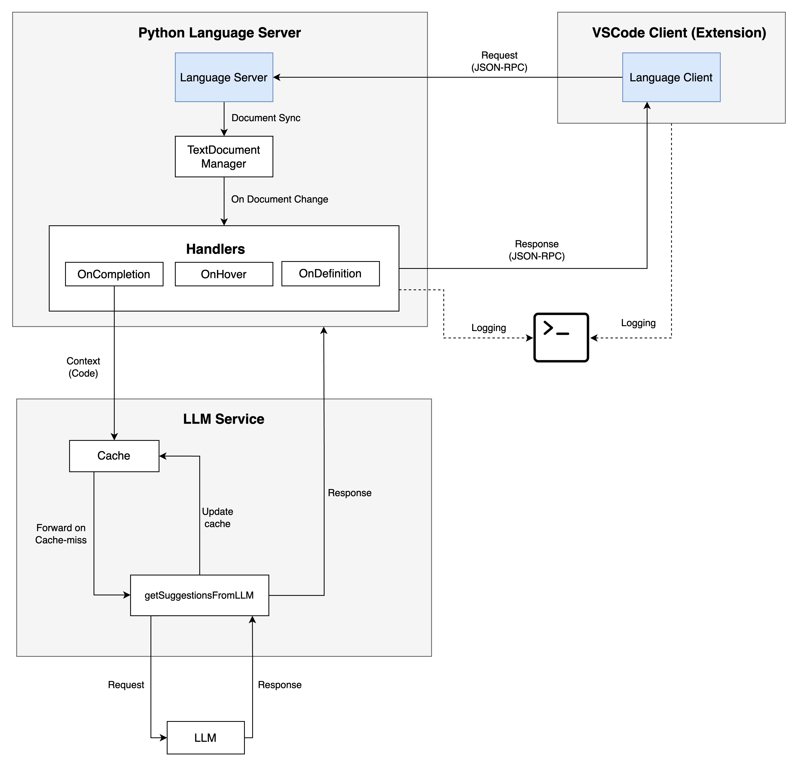

# Python Language Server

A VS Code extension that provides a Python Language Server implementation using Microsoft's Language Server Protocol (LSP). Enhance your Python development experience with intelligent code features, including LLM-assisted code completions.


## Background
Language servers are typically implemented in their native programming languages, which can create integration challenges for code editors like VS Code that run on Node.js. Also, language features can be resource-intensive, requiring considerable CPU and memory to parse files, build ASTs, and perform static analysis.

The Language Server Protocol (LSP) solves these issues by providing a standardized API between language tooling and code editors. Instead of implementing support for M languages in N editors (requiring M * N implementations), LSP reduces this to M + N.


## Features

This Python Language Server currently provides:

- ✅ Function definition detection
  - ✅ Hover information (Dummy)
  - ✅ Go to definition
- ✅ LLM-powered intelligent code suggestions

## Installation

1. Clone this repository
   ```
   git clone https://github.com/syedayazsa/python-language-server.git
   ```

2. Install dependencies
   ```
   npm install
   ```

3. Compile the extension
   ```
   npm run compile
   ```

4. Launch and debug in VS Code
   - Press F5 to launch a new VS Code window with the extension loaded

## Configuration

To enable LLM-powered suggestions, set the `TOGETHER_API_KEY` environment variable with your Together.ai API key.

### Project Structure

```
python-language-server/
├── src/
│   ├── client/         # VS Code extension client
│   │   ├── extension.ts # Client implementation
│   ├── server/         # Language server implementation
│   │   ├── server.ts   # Main server implementation
│   │   ├── llm.ts      # LLM service for intelligent suggestions
│   │   ├── config.ts   # Configuration settings
│   │   ├── logger.ts   # Logging utilities
│   │   └── utils.ts    # Helper functions
│   └── extension.ts    # Entry point
├── test/               # Test files
├── package.json        # Project metadata and dependencies
└── tsconfig.json       # TypeScript configuration
```


## Architecture

The extension follows a client-server architecture:

- **Client**: VS Code extension that communicates with the language server
- **Server**: Node.js process that analyzes Python code and provides language features
   - **LLM Service**: Integrates with an LLM to provide intelligent code suggestions



## TODO

- [x] Implement a Language Server for Python with hover and go-to-definition functionality
- [x] Add basic code completion support
- [x] Integrate with LLM for intelligent code suggestions
- [ ] Add docstrings detection for accurate hover information
- [ ] Add response caching to save up on API call costs
- [ ] Migrate from `Together.ai` to an OpenAI compaitable API
- [ ] Chat Interface

## Contributing
Contributions are welcome! Feel free to submit pull requests or open issues.